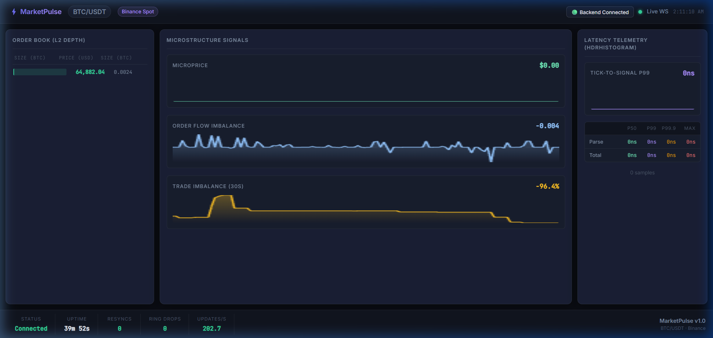

# MarketPulse

A C++20 limit order book and matching simulator that consumes a live exchange
WebSocket feed, maintains the book in memory with lock-free handoff between
threads, and streams microstructure signals and latency telemetry to a browser
dashboard.

**Live demo:** [https://market-pulse-ftr3.vercel.app/](https://market-pulse-ftr3.vercel.app/) · **Live WebSocket:** `wss://marketpulse-live.duckdns.org/ws`



---

## What it does

- Connects to Binance spot depth-diff and trade streams and maintains a local
  L2 book that provably matches the exchange
- Implements the full snapshot-plus-buffered-diff synchronisation state machine,
  including gap detection and automatic resync
- Hands updates from the socket thread to the book thread through a hand-written
  lock-free SPSC ring buffer with no allocation on the hot path
- Computes microprice, order-flow imbalance and rolling trade imbalance
- Simulates resting limit orders against the live book with a queue-position
  model
- Records tick-to-signal latency as an HdrHistogram and publishes percentiles
  live

## Measured performance

Produced by `./build/marketpulse --bench tests/fixtures/btcusdt_clean.jsonl` on
<FILL: CPU, e.g. Ampere Altra, 2 vCPU, Ubuntu 24.04, GCC 14, -O3>.
Reproducible from a clean checkout.

| Tick-to-signal | `std::map` book | Flat ladder book |
|---|---|---|
| p50 | <FILL> | <FILL> |
| p99 | <FILL> | <FILL> |
| p99.9 | <FILL> | <FILL> |
| max | <FILL> | <FILL> |
| throughput | <FILL> updates/s | <FILL> updates/s |

Switch between the two implementations with `--book=map` and `--book=ladder`
to reproduce the comparison.

Timestamp capture overhead: <FILL> ns, measured separately and excluded from
the figures above.

## Correctness

The book is not trusted because it looks right. It is verified three ways:

1. **Live cross-check.** Top-of-book is compared continuously against the
   exchange's independent `bookTicker` stream. <FILL>-hour run, zero
   mismatches.
2. **Differential testing.** Every recorded update is replayed through both
   the `std::map` reference book and the optimised ladder book in lockstep,
   asserting the top 20 levels are identical after each update.
3. **Fault injection.** A fixture with a deliberate sequence gap verifies that
   exactly one resync occurs and the book recovers to a correct state.

Resyncs over the last <FILL> hours of live operation: <FILL>.

## Architecture

```
  Binance WS ──► ingest thread ──► SPSC ring ──► book thread ──► signals
                 parse (simdjson)   lock-free     apply diff        │
                 t_recv, t_parsed   no alloc      t_signal          │
                                                                    ▼
  browser  ◄──── broadcast thread ◄────────────── 10 Hz coalesced snapshot
```

Three threads, one direction of data flow, no shared mutable state protected
by locks.

### Key design decisions

**Fixed-point prices.** All prices and quantities are `int64_t` scaled by 1e8.
Floating point never touches a value that will be compared for equality or
used as a map key. Decimal strings from the wire are converted directly to
fixed point without passing through `double`.

**Hand-written SPSC ring.** The head index, tail index and buffer each sit on
their own cache line via `alignas(std::hardware_destructive_interference_size)`,
so the producer's store to `head` never invalidates the consumer's cache line
containing `tail`. Synchronisation is acquire/release, not sequentially
consistent. Each side caches the opposite index locally to avoid an atomic load
on every operation. The queue is bounded and never blocks: on overflow the
ingest thread increments a drop counter, which is published to the dashboard.

**Flat ladder book.** Levels are a fixed array indexed by tick offset from a
base price, with a parallel occupancy bitmask. Best bid and best ask are found
with a single `countl_zero`, and an update is one array store plus one bit
flip, with no allocation and no pointer chasing. The base price is re-centred
when the mid drifts toward the window edge. The `std::map` version is kept in
the tree as the correctness oracle.

**No database.** State is in memory. A restart resyncs from the exchange
snapshot in under a second, so persistence would add failure modes without
adding capability.

## Simulation model and its limits

A virtual limit order records the resting quantity ahead of it at placement
time as its queue position, decrements as trades print at that price, and
fills when the queue drains.

**This model is optimistic.** An L2 diff feed cannot distinguish an order
cancelled ahead of you from one that filled, so real queue position decays
faster than modelled. Reported fill rates should be read as an upper bound.
Correcting this requires an L3 / market-by-order feed, which is not free.

## Build

```bash
cmake -B build -DCMAKE_BUILD_TYPE=Release
cmake --build build -j
ctest --test-dir build
```

Dependencies (IXWebSocket, simdjson, HdrHistogram_c, Catch2) are fetched by
CMake. Requires GCC 13+ or Clang 17+.

## Run

```bash
./build/marketpulse --symbol btcusdt              # live
./build/marketpulse --bench tests/fixtures/btcusdt_clean.jsonl
./build/marketpulse --book=map --bench <fixture>  # reference implementation
./tools/capture --symbol btcusdt -o out.jsonl   # record a new fixture
```

Dashboard:

```bash
cd web && npm install && VITE_WS_URL=ws://localhost:9001 npm run dev
```

## Deploy

```bash
docker build --platform linux/arm64 -t marketpulse .
```

Runs on a single ARM64 VM behind Caddy for automatic TLS, managed by systemd
with `Restart=always`. See `deploy/` and `Caddyfile`.

Three things that will cost you an evening if you skip them:

- **Oracle Cloud blocks ports twice.** Open them in the VCN security list *and*
  in the instance's iptables. Opening only one does nothing.
- **Exchanges block cloud IP ranges.** Test the WebSocket handshake from the VM
  before building on it. The feed layer sits behind an interface so Coinbase or
  OKX can be swapped in; their sequencing rules differ.
- **The target is aarch64.** No `rdtsc`, no SSE intrinsics. Timing uses
  `std::chrono::steady_clock`.

## Testing

```bash
ctest --test-dir build                                  # unit + differential
cmake -B build-tsan -DSANITIZE=thread && ctest --test-dir build-tsan
```

CI runs GCC and Clang builds with warnings as errors, ASan/UBSan and TSan test
runs, clang-tidy, and a benchmark gate that fails the build if p99
tick-to-signal regresses more than 20% against the committed baseline.

## Not included, deliberately

No database, no authentication, no REST API, no multi-symbol support, no
prediction model, and no connection to a real trading API. The project is
scoped to doing one thing with measurable correctness and measurable latency.

## License

MIT
